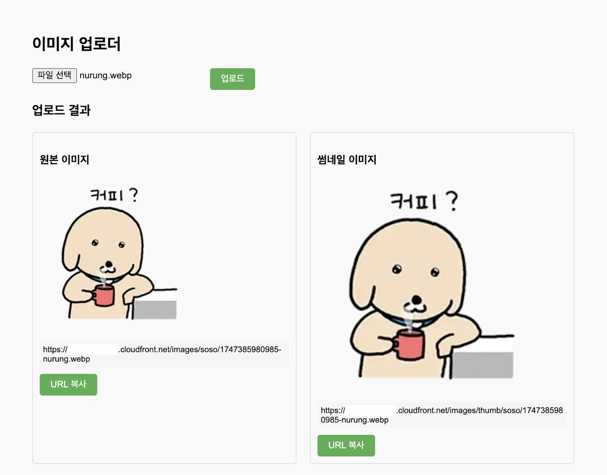
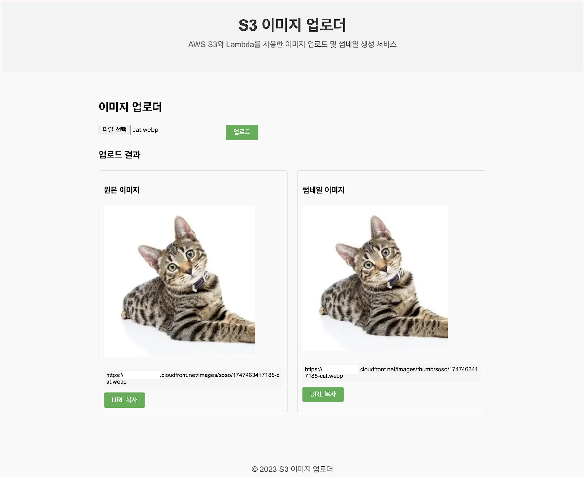

# Vue S3 이미지 업로더

AWS S3, Lambda, CloudFront를 사용하여 이미지를 업로드하고 썸네일을 자동으로 생성하는 Vue 애플리케이션입니다.

## 동작 화면




*이미지 업로드 및 썸네일 자동 생성 기능을 보여주는 화면*

## 기능

- 이미지 파일 선택 및 AWS S3 업로드
- 업로드 진행 상태 표시 
- 업로드 후 Lambda 함수에 의한 썸네일 자동 생성
- CloudFront를 통한 원본 이미지 및 썸네일 제공
- 이미지 URL 클립보드 복사

## 설치 및 설정

1. 저장소 클론 및 의존성 설치
   ```bash
   git clone https://github.com/your-username/vue-s3-uploader.git
   cd vue-s3-uploader
   npm install
   ```

2. 환경 설정
   - `env.example` 파일을 `.env.local`로 복사
   - AWS 설정 정보 입력
   ```bash
   cp env.example .env.local
   # .env.local 파일을 편집하여 AWS 설정 입력
   ```

3. 개발 서버 실행
   ```bash
   npm run serve
   ```

## 환경 변수 설정

프론트엔드(Vue) 환경 변수:
```
VUE_APP_AWS_REGION=ap-northeast-2       # AWS 리전
VUE_APP_S3_BUCKET_NAME=your-bucket-name # S3 버킷 이름
VUE_APP_AWS_ACCESS_KEY=YOUR_ACCESS_KEY  # AWS 액세스 키
VUE_APP_AWS_SECRET_KEY=YOUR_SECRET_KEY  # AWS 시크릿 키
```

## AWS 리소스 설정

### 1. S3 버킷 설정
   - 버킷 생성 및 퍼블릭 액세스 설정 구성
   - CORS 설정 (웹 브라우저에서 직접 업로드 허용):
   ```json
   [
     {
       "AllowedHeaders": ["*"],
       "AllowedMethods": ["GET", "PUT", "POST", "HEAD"],
       "AllowedOrigins": ["http://localhost:8080", "http://localhost:8081"],
       "ExposeHeaders": ["ETag"]
     }
   ]
   ```
   - 버킷 정책 설정 (필요한 경우)

### 2. Lambda 함수 설정
   - S3 버킷에 이미지가 업로드될 때 트리거되는 Lambda 함수 생성
   - Sharp 라이브러리를 사용한 썸네일 생성 함수 구현
   - 썸네일 이미지는 images/thumb/ 경로에 저장되도록 설정

### 3. CloudFront 설정
   - S3 버킷을 오리진으로 하는 CloudFront 배포 생성
   - CORS 헤더 전달 설정
   - 캐시 설정 및 TTL 구성
   - 필요한 경우 OAI(Origin Access Identity) 설정하여 S3에 직접 접근 제한

## 사용 방법

1. 이미지 파일 선택 (지원 형식: JPEG, PNG, GIF, WebP 등)
2. "업로드" 버튼 클릭
3. 업로드 진행 상태 확인
4. 업로드 완료 후 CloudFront를 통한 원본 이미지 확인
5. 잠시 후 썸네일 이미지 생성 확인
6. 필요한 URL 복사하여 사용

## 프로젝트 구조

```
vue-s3-uploader/
├── src/
│   ├── App.vue            # 메인 애플리케이션 컴포넌트
│   ├── ImageUploader.vue  # 이미지 업로드 컴포넌트
│   └── main.js            # Vue 애플리케이션 진입점
├── .env.local             # 프론트엔드 환경 변수 (git에 포함되지 않음)
├── env.example            # 프론트엔드 환경 변수 예시
└── vue.config.js          # Vue CLI 설정
```

## 트러블슈팅

### CloudFront 403 에러 해결

CloudFront를 통해 S3 이미지에 접근할 때 403 Forbidden 오류가 발생하는 문제와 해결 방법입니다.

#### 1. 문제 상황
- CloudFront 배포 후 이미지에 접근 시 403 에러 발생
- S3 버킷 접근 권한 문제 또는 설정 불일치

#### 2. 원인 분석
- Origin Path가 중복 설정된 경우 (/images가 URL에 이중으로 추가됨)
- OAC(Origin Access Control) 연결 오류
- 버킷 정책 설정 미흡

#### 3. 해결 단계

1. **버킷 정책 확인 및 수정**
   ```json
   {
     "Version": "2012-10-17",
     "Statement": [
       {
         "Sid": "AllowCloudFrontServicePrincipal",
         "Effect": "Allow",
         "Principal": {
           "Service": "cloudfront.amazonaws.com"
         },
         "Action": "s3:GetObject",
         "Resource": "arn:aws:s3:::your-bucket-name/*",
         "Condition": {
           "StringEquals": {
             "AWS:SourceArn": "arn:aws:cloudfront::[ACCOUNT_ID]:distribution/[DISTRIBUTION_ID]"
           }
         }
       }
     ]
   }
   ```

2. **CORS 설정 확인**
   ```json
   [
     {
       "AllowedHeaders": ["*"],
       "AllowedMethods": ["GET", "PUT"],
       "AllowedOrigins": [
         "https://[CLOUDFRONT_DOMAIN]",
         "http://localhost:8080"
       ],
       "ExposeHeaders": ["ETag"],
       "MaxAgeSeconds": 3000
     }
   ]
   ```

3. **CloudFront 설정 재확인**
   - Origin Path가 비어있는지 확인
   - OAC 설정이 정상적으로 연결되었는지 확인

4. **CloudFront Invalidation 수행**
   ```bash
   aws cloudfront create-invalidation \
     --distribution-id [DISTRIBUTION_ID] \
     --paths "/*"
   ```

#### 4. 교훈
- CloudFront는 OAC 방식으로 처음부터 세팅하는 것이 권장됨
- 문제가 복잡할 경우 새 배포를 생성하는 것이 더 효율적일 수 있음
- 설정 변경 후 캐시 무효화(Invalidation)는 필수적인 단계

### AWS Lambda Sharp 라이브러리 호환성 문제

Lambda 함수에서 Sharp 라이브러리를 사용해 썸네일을 생성할 때 발생할 수 있는 호환성 문제와 해결 방법입니다.

#### 1. 문제 상황
- Lambda 함수가 Sharp 라이브러리를 사용해 이미지 처리 시 오류 발생
- 로컬에서는 동작하지만 Lambda 환경에서 실행 실패

#### 2. 원인 분석
- Lambda 실행 환경(Amazon Linux)과 개발 환경의 Node.js 버전 차이
- Sharp 라이브러리의 네이티브 바이너리 호환성 문제
- 메모리 제한 또는 실행 시간 초과

#### 3. 해결 단계

1. **Lambda 환경에 맞는 Sharp 설치**
   ```bash
   # Amazon Linux 2 환경에 맞게 Sharp 설치
   docker run --rm -v "$PWD":/var/task amazonlinux:2 \
     bash -c "yum install -y gcc-c++ && \
              curl -sL https://rpm.nodesource.com/setup_14.x | bash - && \
              yum install -y nodejs && \
              npm install --arch=x64 --platform=linux sharp"
   ```

2. **Lambda 함수의 메모리 및 제한시간 조정**
   - 메모리: 최소 512MB 이상으로 설정 (1024MB 권장)
   - 제한시간: 썸네일 생성에 충분한 시간(30초 이상) 설정

3. **Lambda 함수 레이어 활용**
   - Sharp 라이브러리를 Lambda 레이어로 분리하여 관리
   - 미리 컴파일된 Sharp 레이어 사용 고려

4. **Sharp 최적화 설정**
   ```javascript
   const sharp = require('sharp');
   
   // 메모리 사용량 최적화
   sharp.cache(false);
   sharp.concurrency(1);
   
   // 썸네일 생성 예제
   async function resizeImage(inputBuffer) {
     return await sharp(inputBuffer)
       .resize(300, 300, { fit: 'inside' })
       .webp({ quality: 80 })
       .toBuffer();
   }
   ```

#### 4. 교훈
- Lambda 함수에서 네이티브 모듈 사용 시 실행 환경 호환성 고려 필요
- 로컬 테스트와 함께 실제 Lambda 환경에서의 테스트도 필수적
- 최적화된 설정으로 성능과 안정성 확보

## 보안 고려사항

- 프로덕션 환경에서는 프론트엔드에 직접 AWS 키를 노출하지 않도록 주의하세요
- AWS IAM 역할과 정책을 최소 권한 원칙에 따라 설정하세요
- CloudFront + OAI를 사용하여 S3에 직접 접근을 제한하세요

## 참고 자료
- [AWS S3 CloudFront 정리 (403 에러 해결 포함)](https://github.com/lets-go-trip/treaXure-backend/wiki/AWS-S3-CloudFront-%EC%A0%95%EB%A6%AC-(403-%EC%97%90%EB%9F%AC-%ED%95%B4%EA%B2%B0-%ED%8F%AC%ED%95%A8))
- [AWS Lambda Sharp 라이브러리 호환성 문제](https://github.com/lets-go-trip/treaXure-backend/wiki/AWS-Lambda-Sharp-%EB%9D%BC%EC%9D%B4%EB%B8%8C%EB%9F%AC%EB%A6%AC-%ED%98%B8%ED%99%98%EC%84%B1-%EB%AC%B8%EC%A0%9C) 